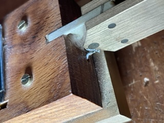
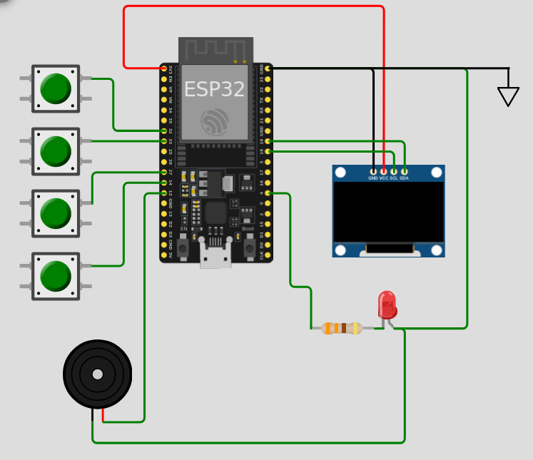
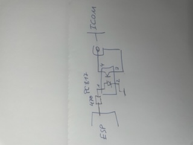
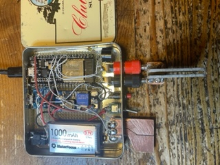

# Iambic Keyer for ESP32 with TouchPad
+ VERSION = "0.964 20.12.23" 

### IAMBIC keyer in MicroPython for ESP32

* Iambic Mode A/B
* Command function over keyer
* Display OLED SSD1306
* Short key for command and WPM
* Send CW text from memory text-buffer
* Transmit by sound (internal speaker)
* Transmit by LED
* Transmit by optocoupler
* Parameters are stored in a JSON file
* Bluetooth send, output text from keyer, and command infos

---



In the photo, you can see the CW Keyer with the two paddles, **DIT**, and **DAT**.  
The OLED display, and two more buttons: **Command** and **WPM/Text**.  
It is a minimalist device, based on the MicroPython `code`, installed on ESP32 with Thonny Tool.
No `pcb` board, simply solder connectors directly on ESP32, and assemble it in a box.

# Start

After turning it on, the keyer **appears ready**.
The keyer is in send mode; you can input CW code using the **DIT** and **DAT** buttons.
The characters are sent directly to TX out, decoded, and displayed as text on the OLED display.

Pressing the **Command button** switches to **Command mode**; pressing it 
again returns to **Operation  mode**."

# Use

## Operate and Command Mode

### Operate

You can send MORSE code with the **DIT** **DAT** paddle.

### Command

Hit the command button and use a morse letter for the command you will execute.

### Keyer Sound

The *command* and *operation* mode are signaled by two different tone frequencies, command and sidetone.
The sidetone can be turned off and on.

### The procedure for the Command mode is as follows:

| Operation Mode |  Command Mode  |          Responce          |
|:--------------:|:--------------:|:--------------------------:| 
|   Operation    |                |                            |
| Button Command |                |                            |
|                |       c        |          Out time          |
|                | Button Command |                            |
|   Operation    |                |                            |
|   Operation    |                |                            |
| Button Command |                |                            |
|                |       o        | Sidetone toggle (on) (off) |
|                | Button Command |                            |
|   Operation    |                |                            |

### Command Table

* a -> Iambic Mode A
* b -> Iambic Mode B
* m -> (?) request Iambic Mode A/B

* ? -> request value of ...

* i -> (?) TX_opt enable(on) disable(off)

* o -> (?) Sidetone toggle (on) (off)

* f -> (?) adjust sidetone frequency
* v -> (?) adjust sidetone volume 1-100

* r -> (?) adjust dit/dat ration volume 2.3-3.7
* w -> (?) adjust Words Per Minute
* l -> adjust weighting  controll dit high low time
* H -> Set weighting and dah/dit ratio to defaults 50% 1:3

* t -> tune mode, end with command mode
* s -> save parameter to file

* l ->   Adjust weighting

* c -> show time
* d -> show date

* / -> print json data file

* x -> exit command mode

**Note:** The definition of key-command is a copy from kn3g keyer, which I have been using for 5 years


### CW timing 
#### Calculating Morse Code Speed
Doku source [kent-engineers](https://www.kent-engineers.com/codespeed.htm).

The word PARIS is the standard for determing CW code speed. Each dit is one element, each dah is three elements, intra-character spacing is one element, inter-character spacing is three elements and inter-word spacing is seven elements. The word PARIS is exactly 50 elements.
Note that after each dit/dah of the letter P -- one element spacing is used except the last one. (Intra-Character).
After the last dit of P is sent, 3 elements are added (Inter-Character). After the word PARIS - 7 elements are used.
Thus:
+ P = di da da di = 1 1 3 1 3 1 1 (3) = 14 elements 
+ A = di da = 1 1 3 (3) = 8 elements
+ R = di da di = 1 1 3 1 1 (3) = 10 elements
+ I = di di = 1 1 1 (3) = 6 elements
+ S = di di di = 1 1 1 1 1 [7] = 12 elements
+ Total = 50 elements
+ () = intercharacter
+ [] = interword 

Calculation DOTime with the word **Paris**, normalized  ration_signal 1/3  weight_sign 50%
* (dithc, ditlc, dathc, sum) Paris  
* (10,     28,    12,   50)   
* dithc -> signal "."
* ditlc -> space
* dathc -> signal "-"
```
self.PARIS = 50
self.DOTtime_norm =  60.0 / self.wpm_t / self.PARIS * 1000  ## mili sekunden
        
self.paris_time = self.DOTtime_norm * (1 / 100 * 50 * 10 + 1 / 100 * (100 - 50) * 28 + 1 / 100 * 50 * 12/3 * 3)
        
        
#calulation of normalized dotime
self.nDOTtime = self.paris_time / (1 / 100 * self.weighting_t * 10 + 1 / 100 * (100 - self.weighting_t) * 28 + 1 / 100 * self.weighting_t * 12/3 * self.ratio_t)
        
self.DOTtime  = self.nDOTtime / 50 * (self.weighting_t)
self.pDOTtime  = self.nDOTtime / 50 * (100-self.weighting_t)
```
>[NOTE]
> When the reference word PARIS is calculated with a different ratio or weighting, the typing speed in words per minute (wpm) may vary slightly.

## Times between Characters and Word
>[NOTE]
> There may be input errors and thus the loss of characters if the timing between characters and words is not maintained.

### timing Wait for direct or latched paddle press
The times are set in the source code, but you can, of course, adjust them to your preferences.

```
            if utime.ticks_ms() > (self.ktimer_end + cw_time.dit_time() * 4.5):  # Word space time
            if utime.ticks_ms() > (self.ktimer_end + cw_time.dit_time() * 1.5): # chare space time
```

#### RATIO 
With command **r** you can adjust the length(DASH)/length(DOT) ratio
1.3 to 6
### Weighting 
Adjust Weighting the time DIT high/low default ist 50% 

#### WPM
With command **w** , wpm (Words Per Minute) you can adjust the cw speed.
### Query Parameters ?


1. Press **command button**.
1. Send the **letter** "?" followed by the **letters** of the parameter. In response,
   the value of the parameter is sent. You remain in command mode.
1. End by pressing the **command button**

***Example:*** ? v respond is 200

**Note:** All commands with a question mark (?) can be queried

## Command Button

### Command for Send Memory Text

1. Press **WPM button** once
1. **DAT** key switches to the next text from the memory.
1. **DIT** confirm your selection and start CW sending of the text,
1. another **DIT** calls up the text again
1. **DAT** key switches to the next text from the memory.
1. Press **Command button** to exit memory text recall mode.

### Command for Set WPM  Words Per Minute

1. Press **WPM button** twice
1. **DAT** key decreases the Value
1. **DIT** key increases the WPM Value
1. Press **Command button** to exit WPM.

### Save command

After changing parameters, don't forget to execute the save command.

## Software Installation

1. Install Thonny on your PC/MAC
2. Connect to an ESP32 via USB
3. Copy all files to ESP32
4. When everything works as intended, save the program as main.py
5. If the JSON file is wrong, you can start in factory mode (hold command button while booting)

## Error (-.-.--.-?)

If you enter a letter incorrectly or the character spacing is not correct, the character will not be recognized and a ?
attached

```(-.-.--.-?) is not  (-.-.) (--.-) cq```

That helps to send correct CW code with proper character and word spacing timing.

## Configuration

Main parameters are set up in JSON file.
You can change the parameters in command mode of the keyer, or edit the json.txt file.

```json
"{\"threshold_key\": 200, 
\"sidetone_freq\": 700, 
\"iambic_mode\": 16, 
\"tx_enamble\": 0, 
\"sidetone_enable\": 1, 
\"sidetone_volume\": 10, 
\"wpm\": 17, 
\"txt_emable\": 0, 
\"cq_txt_liste\": [\"cq cq de dl2dbg dl2dbg bk\", \"dl2dbg\", \"cq cq test dl2dbg\", \"cq\", \"uli\", \"cq cq\"]
}"
```

#### defintion in code

```pyhton
self.cq_liste =["cq cq de dl2dbg dl2dbg bk","dl2dbg","cq cq test dl2dbg","cq","uli","cq cq"]
```

## Pinout

Hardware setup, pin on ESP32

| Function             | Pin |
|----------------------|-----|
| Onboard LED          | 2   |
| External LED Pin     | 23  |
| TX Opt Pin           | 4   |
| CW Sound Pin         | 12  |
|                      |     |
| TouchPad DIT Pin     | 32  |
| TouchPad DAH Pin     | 33  |
|                      |     |
| TouchPad Command Pin | 27  |
| TouchPad WPM Pin     | 14  |
|                      |     |




### Optocoupler

The transmitter is controlled via an optocoupler open collector.  
You can use a PC817 for this.

### High-Frequency Problem

If there is a high-frequency problem, an RF filter can be connected to the line. Simple low pass.

## Assembly and Bill of Materials

KIS -> Keep It Simple

* J2 2.5mm jack (headphone)
* Optocoupler for connecting the transceiver
* Button for command mode
* Button for WPM (words per minute)
* Option for external command LED

## touch sensor
In order for the touch sensor to function properly, a minimum size of metal surface is required so that the finger establishes good contact.
## Future

### Some Ideas / Options on Demand?

No wishes :-)

## References

Translator

* MarkWoodworth xiaokey [https://github.com/MarkWoodworth/xiaokey](https://github.com/MarkWoodworth/xiaokey)
* Iambic Morse Code Keyer Sketch Copyright (c) 2009 Steven T.
  Elliott [https://github.com/sergev/vak-opensource/blob/master/hamradio/arduino-keyer.c](https://github.com/sergev/vak-opensource/blob/master/hamradio/arduino-keyer.c)

## Hardware of My Keyer

Self-built in oak and brass. All buttons are touch.


A second one, built as a keyer in a box without a display and with simple sensor buttons.


## Different Hardware Setup

### Option

* OLED
* BLE

In the code are different class definitions. One is "active," the other is "dummy."  
You can enable or disable the class by simple comment out.

## OE Class Selection

1. Print only on console
2. Print on console and OLED display
3. Print on console, OLED display, and BLE

```python
ble = ESP32_BLE("ESP32BLE_CW")     # BLE enable # use Serial Terminal like "esp32 ble terminal on iPhone"
# ble = ESP32_BLE_pass("ESP32BLE_CW") # BLE disable an empty class definition

oe = CONSOLE_Print() # print only console
# oe = OLED_Print()   # print with OLED display and BLE
# oe = BLE_Print()    # now OLED, only print and BLE
```

## Bluetooth Pairing

Successfully tested with iPhone 12, MacBook, and Android Samsung.

## Bluetooth Pairing Fails?

It may be that a connection is not possible. See the note for Android.

### Bluetooth Pairing Fails for Android Phones with MediaTek Chipset (IDFGH-5014)

**Problem Description**  
One-to-one copy from this link (https://github.com/espressif/esp-idf/issues/6800)

The ESP32 Bluetooth cannot pair with certain Android phones that use MediaTek chips supporting Bluetooth 5.0. The
affected phones include LG Stylo 6, LG Phoenix 5, and Alcatel 3V. Phones/tablets that do not use the MediaTek chipset
for Bluetooth will pair with no issues, such as the Pixel, Pixel4 (Qualcomm), and Hytab-plus-10wb1 (XRadio).

When capturing the Bluetooth pairing packets, I noticed that there was an LL_REJECT_IND_EXT opcode from the device
common to all affected phones, which may indicate why the connection was dropped. I also tried ESP-IDF Pre-release
v4.3-beta2 with different Bluetooth module options, but the issues still persist.

### Time Command

The command output can be different.  
Uptime reports the ESP32's time relative to January 1st, 2000.  
Correct time because the system time was given by Thonny when starting.

### Power Consumption of ESP32

The power consumption of an ESP32 microcontroller can vary significantly depending on various factors, such as connected
peripheral devices, the activity of the microcontroller, and the implemented power-saving measures. Here are some
general guidelines.

#### Active Mode without BLE:

In active mode without BLE, the power consumption of the ESP32 can range from about 40 mA to several hundred mA,
depending on the specific configuration and activities.

#### Active Mode with BLE:

When BLE is enabled, power consumption usually increases. The exact consumption depends on the BLE configuration and
transmission activity. A typical estimate could range from 60 mA to 100 mA.

## Add-On Software

It's still tests and utility programs on GitHub.

* `i2csan.py` for HW test of the I2C display.
* `touch_demo` for testing the touch key.
* `ble_test` simple BLE server with output number, test for scan, connect, and receive.

### touch_demo1

`touch_demo1` helps to test the touch pin. It will output a value that changes with and without contact. Use this to
adjust the threshold value.

---

### MicroPython Version

READY for new MicroPython v1.21.0 on 2023-10-05;


