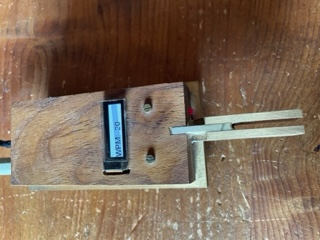

# iambic keyer for es32 with touchPad
21.11.23 
READY for new MicroPython v1.21.0 on 2023-10-05; 
I update of my software, and deleted Bluetooth modules, because they no work with the new v1.21.0 version. I coud not identified the cause :-(


IAMBIC keyer in micropython esp32
* Iambic Mode A/B
* command function over keyer 
* display old ssd1306
* short key command and WPM 
* send CW text from text-buffer 
* Transmit by sound (headphone)
* Transmit by LED
* Transmit by optocoupler
*
* bluetooth print text from keyer and command infos

 


profession Version :-)


It is a minimalist device based on the micropython `code`  installed on esp32 with Thonny Tool.

No `pcb` board, simply solder connectors directly on esp32, and/or assemble it in a box

## Features
* i2csan.py  for HW test of the I2C display 
* touch_demo for test the touch key
 
Command

Hit the command button and use a morse letter. The definition is copy from kn3g keyer, which I have been using for 5 years 

* a -> Iambic Mode A
* b -> Iambic Mode B
* m -> request Iambic Mode A/B

* ? -> request value of ...

* i -> TX_opt enable(on) disable(off)
 
* o -> Sidetone toggle (on) (off)

* f -> adjust sidetone frequency
* v -> adjust sidetone volume 1-100
 

* t -> tune mode, end with command mode
* s -> save parameter to  file

* x -> exit command mode


## Software Installation

1. Install Thonny on your PC/MAC 
2. connect to a esp32 to USB
3. copy all file to esp32
4. when everything works as intended, save the program as main.py
5. if the  json file is wrong, you can start in factorymode (hold command button while booting)


## Configuration
Main parameters are set up in json file.
You can change the parameters in command mode of the keyer, or edit the json.txt file.  
```
 "{
 \"txt_emable\": 0,
 \"sidetone_volume\": 10,
 \"sidetone_freq\": 700,
 \"sidetone_enable\":1,
 \"tx_enamble\": 0,
 \"iambic_mode\": 16,
 \"wpm\": 18
}"
```
## Pinout

Setup Hardware pin on esp32
```
 
onboard_led      = 2 
extern_led_pin   = 23 
tx_opt_pin       = 4 
cw_sound_pin     = 12

touchPad_dit_pin = 32
touchPad_dah_pin = 33

touchPad_command_pin  = 27
touchPad_wpm_pin      = 14
```


## Assembly and Bill of Materials


KIS -> keep it simple

* J2 2.5mm  jack (headphone)
* optocoupler for connecting the transceiver
* button for command mode
* button for WPM (words per minute) 
* option for external command led

## Future

Some Ideas / options on demand:

*  
*  

## touch_demo1

touch_demo1 help to test the touch pin.
It will output a value that changes with and without contact. 
Use this to adjust the threshold value.

## high frequency problem
If there is a high frequency problem, an RF filter can be connected to the line. simple low pass.


## References

* MarkWoodworth xiaokey https://github.com/MarkWoodworth/xiaokey
* Cornell University ECE4760 RP2040 testing http://people.ece.cornell.edu/land/courses/ece4760/RP2040/index_rp2040_testing.html 
* Iambic Morse Code Keyer Sketch Copyright (c) 2009 Steven T. Elliott https://github.com/sergev/vak-opensource/blob/master/hamradio/arduino-keyer.c

## Hardware

Self-built in oak and brass.
all Buttons are touch.


